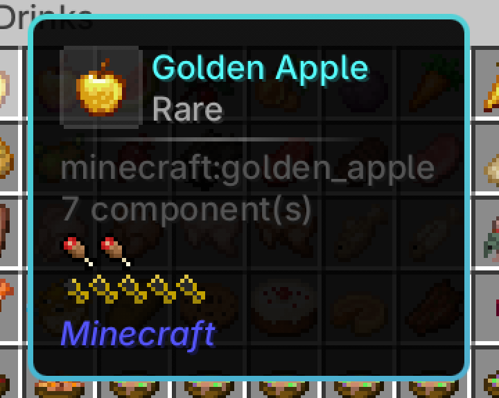

<div align="center"><center>

# ModernObscure

[](https://github.com/PageQwQ/ModernObscure)
[](https://fabricmc.net)
[![Available for NeoForge](https://img.shields.io/badge/Available%20for-NeoForge-f16436?logo=data:image/png;base64,iVBORw0KGgoAAAANSUhEUgAAACAAAAAgCAMAAABEpIrGAAABhGlDQ1BJQ0MgcHJvZmlsZQAAKJF9kT1Iw0AcxV/TiqIVBwuKOASsTnZREcdSxSJYKG2FVh1MLv2CJg1Jiouj4Fpw8GOx6uDirKuDqyAIfoC4ujgpukiJ/0sKLWI8OO7Hu3uPu3eA0Kgw1QxEAVWzjFQ8JmZzq2L3K/oQQgBjGJKYqSfSixl4jq97+Ph6F+FZ3uf+HP1K3mSATySOMt2wiDeIZzctnfM+cYiVJIX4nHjSoAsSP3JddvmNc9FhgWeGjExqnjhELBY7WO5gVjJU4hnisKJqlC9kXVY4b3FWKzXWuid/YTCvraS5TnMUcSwhgSREyKihjAosRGjVSDGRov2Yh3/E8SfJJZOrDEaOBVShQnL84H/wu1uzMD3lJgVjQNeLbX+MA927QLNu29/Htt08AfzPwJXW9lcbwNwn6fW2Fj4CBraBi+u2Ju8BlzvA8JMuGZIj+WkKhQLwfkbflAMGb4HeNbe31j5OH4AMdbV8AxwcAhNFyl73eHdPZ2//nmn19wOjxHK68ogHXgAAAAlwSFlzAAALEwAACxMBAJqcGAAAAAd0SU1FB+cLFAQpNXrCg1cAAAHsUExURQAAAIuOlHV1gIuOlH6AiYuOlJ6jpxMVGh4hKSYqM2ZTTXFcVXV1gHlSSHtjXIGDjIJtZ4OFjYSGjoVqYoWHj4aIj4dudYeEhYqNlIuOlIyPlo1xaI15c42Jho2QlpCUmZOWnJSSj5SXnJWZnpaboJdPPZeboJidoZqfo5taQpyhpZ5VJp9XLJ+kqKBZMaClqaFTO6KMh6Koq6OprKRON6WqrqWrrqZoW6ZxaaatsKeKiKetsKitsaiusamfn6mjpKqUjaqws6tTNqyzsqyztq6pp6+2uLGalrKjobK5u7NZNbS8vbW7u7W9vrW9v7afnbaoora+v7a/wLeBjLehnbeqqLi/v7jAwbjCwrldNbnBw7vExb1mK73Fx73Gxr3Hx76Zjr9hNL+Ecr+7ub/HxsBjM8DIysDKysF3a8GJd8GcksHLy8LMzMOHi8PLysPNzcPOzcTOzsVmM8XPz8bR0MejucfR0cjT08nU08qwrMtrMsttLcvU1cvV1cy/uszAu83X2M5tMc90Nc/a2c/a2tFwMNKgjNNxMNRyMNR5NtSMatS6t9TMytXg39d0L9nCu9nl5NuWd9zY2N3Iw96+tt+wnuCCNODNzeKHNeLu7eaMN+by8efZ0+ja2Ozg3O/o5/Dn5PXu7Pn09P///+RBO4EAAAAHdFJOUwAQQEBwgJ+al5Z5AAAAAWJLR0Sjx9rvGgAAAkNJREFUGBkFwT9vG3UAANB3dz/7bNfnxO61UkAhiSBCFGWhHcqGxMrKxtfgMyCVL8HYHRbKyNCJobJYIEoqkWIwSWPHzdkX3x/ei0QxAAAAmjaIHwIAAGBeh070hN0+YFkAAD/HId/7gmEMuK0BgDezIB3OXh12M+Y/8uXe6u+XfP4e1vNsshGEuFrM0pazf/lncn11xVUf5eIuaiRZ3bSHqtvbH16Pq+bowXBxHnZOf/+UsDPwpozF404dehcXUed4pLy6Ko2OO9HFBaqyFfT2/5vlyUvj429+evH62tKTr/z50tcsiq2gLiqVxGa5bZN7I1XSbpebBNJtJMnCoLApmnxWHizDx/nuOJr4tfgkf0iazcoA4GC0eTDZT5XDZHN0A8pVIwB46t1ePog1w8vZI1NYFZUAOPYRCTC6xwYgAHr6ALroaYAAkvZE3m7LknekaSc6MY1qCFWFJl7T/JX2GliWh8laL6oTdRWvC7T16anVs+c2BZ4/Wzk9zYY7Q7frgHJVt481d21jVUqzpr1r9vwRda4RsCrWVa66aVvLa+OsbW92cy9CH5Ju+mGxTToXZx8k+dNBOp4Mw8H7+80vZ22ImFcBxObq8Bkp3L+vnsuAAGDK49G3C7vf3/wGgBgAAAAgADJTHo2+a8TWUzKAoCnLy1GXwNtJUQmDtwHc3fSGRMPeyfnlUQ7KO9BNweV5fjTdBAwmXSAAAehOBggYdvpAkgBAf5wiiuPdukliAAA0dZwsmkg8AAAAQNEAAAAA+B8LzexYIpdh2QAAAABJRU5ErkJggg==)](https://neoforged.net)


A multi-loader (Fabric & NeoForge) mod hat bridges ModernUI's rounded SDF tooltip backgrounds with obscure-tooltips' feature-rich tooltip system.

The mod requires [Obscure Tooltips](https://modrinth.com/mod/obscure-tooltips), [Fragmentum](https://modrinth.com/mod/fragmentum) and recommends [ModernUI](https://modrinth.com/mod/modern-ui), [Cloth Config](https://modrinth.com/mod/cloth-config).



</center></div>

## Building from Source

Requires JDK 21.

```bash
git clone https://github.com/PageQwQ/ModernObscure.git
cd ModernObscure

# Place required dependencies in libs/ directory:
# - obscure_tooltips-fabric-1.21.1-4.2.5.jar
# - fragmentum-fabric-1.21.1-5.0.0.jar
# - obscure_tooltips-neoforge-1.21.1-4.2.5.jar
# - fragmentum-neoforge-1.21.1-5.0.0.jar

JAVA_HOME=/path/to/jdk-21 ./gradlew build
```

Built JARs:
- `fabric/build/libs/modernobscure-compat-fabric-*.jar`
- `neoforge/build/libs/modernobscure-compat-neoforge-*.jar`

Each supported Minecraft version lives on its own branch and needs that version's `obscure_tooltips` and `fragmentum` jars in `libs/` — see [Project layout](#project-layout) for the branch table. Gradle itself needs JDK 21; the 1.20.1 branch compiles against a Java 17 toolchain.

## Technical Notes

### Project layout

ModernObscure is a multi-loader project built with Architectury Loom. Shared code lives in `common/`; each loader module (`fabric/`, `neoforge/`, `forge/`) contributes only its own metadata and the handful of mixins whose target methods are named differently per loader. The loader modules pull `common/` into their own output — by adding its source directories to their source set, or by bundling its classes into their jar — rather than consuming it as an ordinary library, because NeoForge's transformer layer rejects classes that resolve Minecraft through the app classloader.

Every supported Minecraft version has its own branch, because the tooltip API it bridges changed between them:

| Branch | Minecraft | Modules | Obscure Tooltips |
|---|---|---|---|
| `main` | 1.21.1 | `fabric`, `neoforge` | 4.2.5 |
| `1.20.1` | 1.20.1 | `fabric`, `forge` | 3.10.1 |
| `1.21.11-fabric` / `1.21.11-neoforge` | 1.21.11 | `fabric`, `neoforge` | 5.0.0 |

### How the bridge takes over the tooltip

obscure-tooltips replaces vanilla's tooltip rendering completely (it cancels `GuiGraphics.renderTooltipInternal`), and ModernUI does the same for its own tooltips. Both want the same call, and the order in which mixins from two different mods are applied is not something either of them can control, so the hand-off has to be explicit:

- `MixinGuiGraphics` runs at priority 0, ahead of both. When the component list carries obscure-tooltips' `StackBuffer` component it hides ModernUI's tooltip option, invokes obscure-tooltips' renderer directly and cancels vanilla's body. ThreadLocal guards in `CompatState` keep obscure-tooltips' own handler from drawing the same tooltip a second time.
- `MixinGameRenderer` restores the ModernUI option at the end of every frame as a catch-all, so a cancelled or early-returning path can never leave it switched off.

### Rounded background

`ModernUIBackgroundRenderer` replaces `TooltipState.renderPanel` with ModernUI's own `drawRoundedBackground`, so the panel, its 4-corner border gradient, the rainbow/spectrum cycling and the corner radius are all ModernUI's. `TooltipState.renderFrame` is skipped entirely, because the SDF background already draws the border.

All ModernUI access goes through reflection (`TooltipRenderer`, `UIManager`, `GuiRenderType`, `MuiModApi`), so there is no compile-time or hard runtime dependency on it. The drop shadow is temporarily disabled for the draw: ModernUI inflates the shadow quad by `shadowRadius * 1.2`, which writes depth across a rectangle larger than the tooltip and makes later HUD geometry fail the depth test.

### Rarity glow

obscure-tooltips' back effects are hardcoded rectangles derived from the layout box inflated by 3 px, so against ModernUI's rounded panel the glow keeps square corners and pokes past the border. `ModernUIRoundedEffects` intercepts `TooltipState.renderEffects` and redraws `RimLightEffect` and `ShimmerEffect` with their exact maths — same palettes, same easing, same vertex colours, same render state — but along a rounded outline sampled by arc length. Anything it does not recognise falls through to obscure-tooltips' own draw, so no resource pack is added and no obscure-tooltips jar is modified.

Four details are worth knowing before touching that code:

- The outline radius comes from ModernUI's `sCornerRadius`, and the band starts at the **inner edge of ModernUI's border** (`H_BORDER - sBorderWidth / 2`). ModernUI centres an `sBorderWidth`-thick stroke on the panel outline, whereas obscure-tooltips draws its own 1 px border flush with the panel edge; a fixed 3 px offset therefore leaves a sub-pixel strip of dark panel fill between border and glow, which shows up as a black hairline around the tooltip at high GUI scales.
- The shimmer's travelling wave reproduces obscure-tooltips' actual maths: in 4.2.5 that is JOML's `Vector2f.angle` between the control-centre vector and the point vector, measured at the screen origin, rather than an angle around the control centre. It looks like a mistake, but reproducing it verbatim is what keeps the glow's pattern identical to the original.
- Glow quads must keep obscure-tooltips' winding. `RenderType.guiOverlay()` carries no cull-state shard, so the GL cull state left over from the previous GUI draw still applies and a mirrored quad is silently back-face culled.
- `ShimmerEffect` also owns an additive "glowing renderer" GL state on 1.20.1; the replacement reproduces `TooltipHelper.enableGlowingRenderer()` / `disableGlowingRenderer()` because it replaces the whole effect body.

### Tooltip transition

`TooltipTransition` redirects the `ClientTooltipPositioner.positionTooltip` call — the single point where obscure-tooltips decides where the tooltip goes, and therefore the one place that moves the background, frame, effects and content as a unit — and eases the result toward the real position with frame-rate independent exponential smoothing. Large jumps snap instantly so that a side flip does not slide across the cursor. The size transition is injected right after obscure-tooltips pushes its outer frame pose, so the scale covers everything and is popped again by obscure-tooltips' own `popPose`.

Settings persist as a plain JSON file (`config/modernobscure-compat-client.json`) through `CompatClientConfig`, which keeps the shared code free of any loader config API. `CompatConfigScreen` builds the Cloth Config UI and is only ever class-loaded when Cloth Config is present, which is what keeps both it and Mod Menu optional.

### GL state handling

GUI render types re-apply their own depth, blend and fog state when they are drawn, so the compat has to manage the GL state around the SDF background rather than set it and forget it:

- The background writes depth across the whole panel, so content is lifted by 0.1 in z and `GL_ALWAYS` is used to keep later content and other mods' overlays visible.
- Depth test, `GL_LEQUAL`, shader colour and blending are restored once the tooltip is done; without that, whole HUD elements such as Create's banner vanish because they fail the depth test at equal depth.
- `MixinRenderSystem` freezes fog while tooltip content is being buffered. ModernUI's glyph shaders read fog uniforms from `RenderSystem` statics, and a mid-loop flush triggered by any mod's tooltip component would otherwise draw every glyph fogged to black.
- AppleSkin's hunger bar is re-rendered after the SDF flush with clean GL state; `setAccessible(true)` is needed because NeoForge's `FoodTooltipRenderer` is package-private.
- `ModelViewStack` depth is tracked and restored around ModernUI's internal push/pop, which used to crash with "max stack size of 16" when it was left unbalanced.

### Version and loader differences

The effect rewrite is not shared code, because each version draws differently:

- **1.21.1 (Obscure Tooltips 4.2.5)** — effects write into a `MultiBufferSource` with `RenderType.guiOverlay()`, `QuadPalette` holds plain `ARGB`, and `TooltipState.renderEffects` calls `renderBack` directly, so a `@Redirect` on that call site is enough.
- **1.20.1 (Obscure Tooltips 3.10.1)** — the same buffer API, but palettes and shimmer colours are `ARGBProvider` values, and `renderEffects` submits each effect through `graphics.drawManaged(() -> effect.renderBack(...))`. That call therefore sits inside a synthetic lambda which `@Redirect` cannot reach, so the whole loop is replayed from an `@Inject` at HEAD and cancelled.
- **1.21.11 (Obscure Tooltips 5.0.0)** — the GUI pipeline was rewritten: poses are `Matrix3x2f` and quads are submitted as render states through `GraphicUtils.submitQuad`, so there is no `RenderType.guiOverlay()` to reuse.

A few mixins are duplicated per loader because their target is named differently in each jar. The clearest example is the header component's slot drawing: `renderImage` in the official namespace (NeoForge/Forge, and remapped by Loom to the Fabric intermediary `method_32666`) versus the SRG name `m_183452_` in the 1.20.1 Forge jar. `MixinClientConfig` follows Fragmentum 5.0.0's Kotlin config API (`ConfigBuilder` in `dev.obscuria.fragmentum.api.config`, `Configurable` instead of `ConfigValue`, `defineBool` instead of `defineBoolean`).

One environment quirk is worked around rather than fixed: Loom's merged Forge 1.20.1 jar ships a corrupted generic signature for `ConfigScreenHandler.ConfigScreenFactory` — javac reads `BiFunction<RuleTest, AnyOfCondition, AnyOfCondition>` instead of `BiFunction<Minecraft, Screen, Screen>`, so no typed lambda can be compiled against it. The Forge entrypoint therefore passes the raw `Function` type and lets the erased single-argument overload be selected at runtime.

### Runtime dependencies

- [Obscure Tooltips](https://modrinth.com/mod/obscure-tooltips) and [Fragmentum](https://modrinth.com/mod/fragmentum) — the tooltip system this mod bridges to.
- [ModernUI](https://modrinth.com/mod/modern-ui) — recommended; without it the mod falls back to obscure-tooltips' own rendering.
- [Fabric Language Kotlin](https://modrinth.com/mod/fabric-language-kotlin) — required on Fabric, because Fragmentum 5.0.0 is written in Kotlin.
- [Cloth Config](https://modrinth.com/mod/cloth-config) and [Mod Menu](https://modrinth.com/mod/modmenu) — optional, only used for the config screen.
